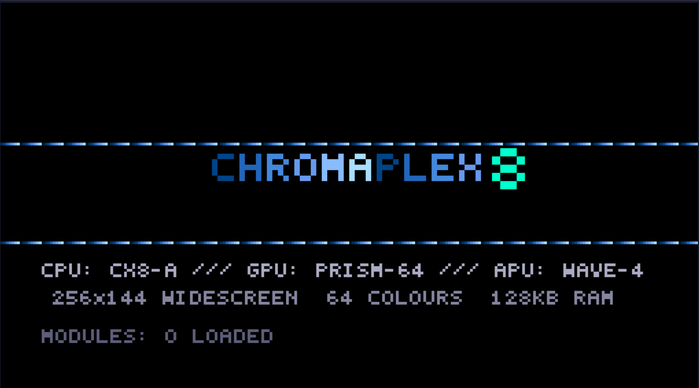
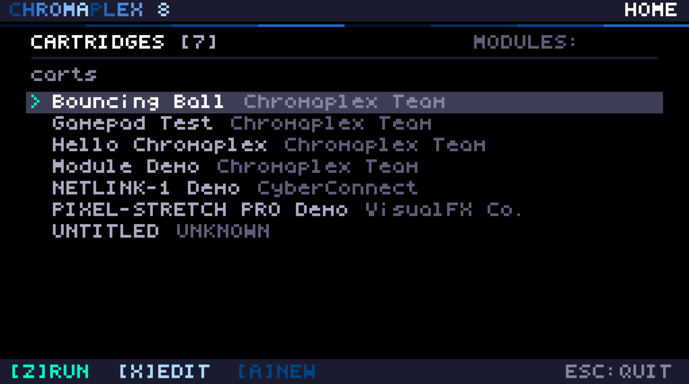
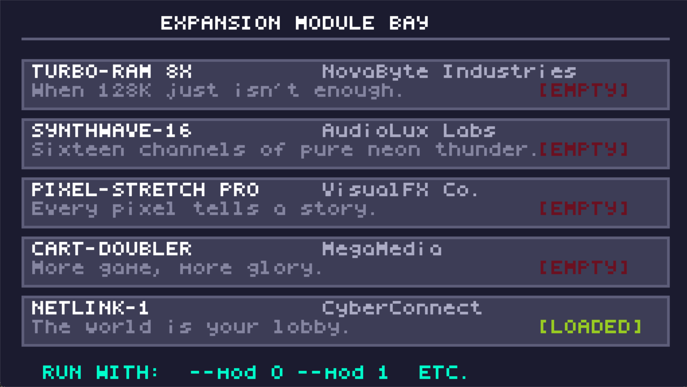
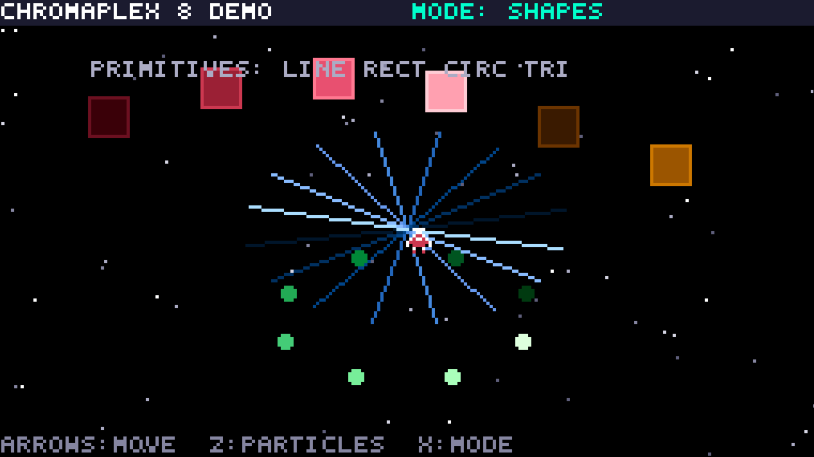
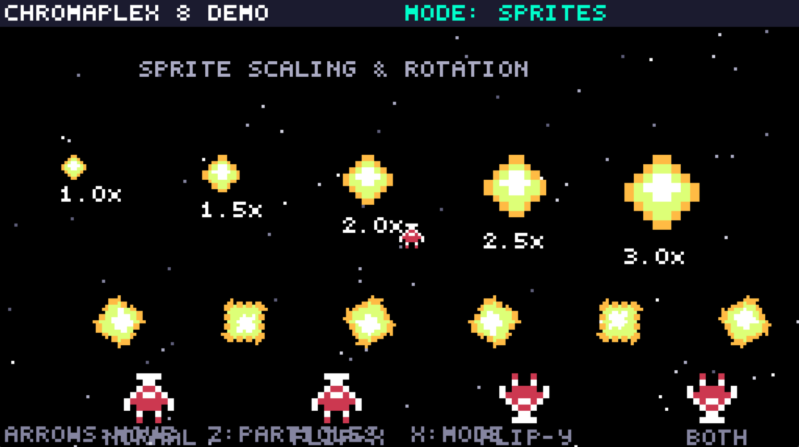
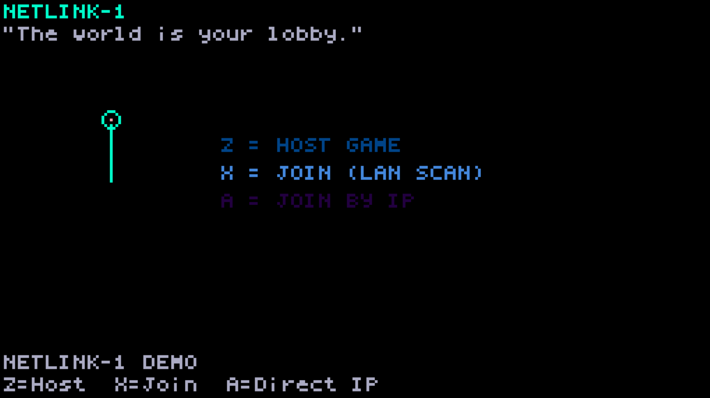
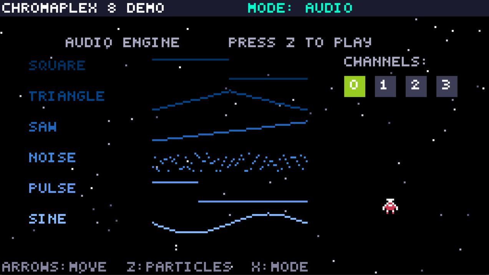
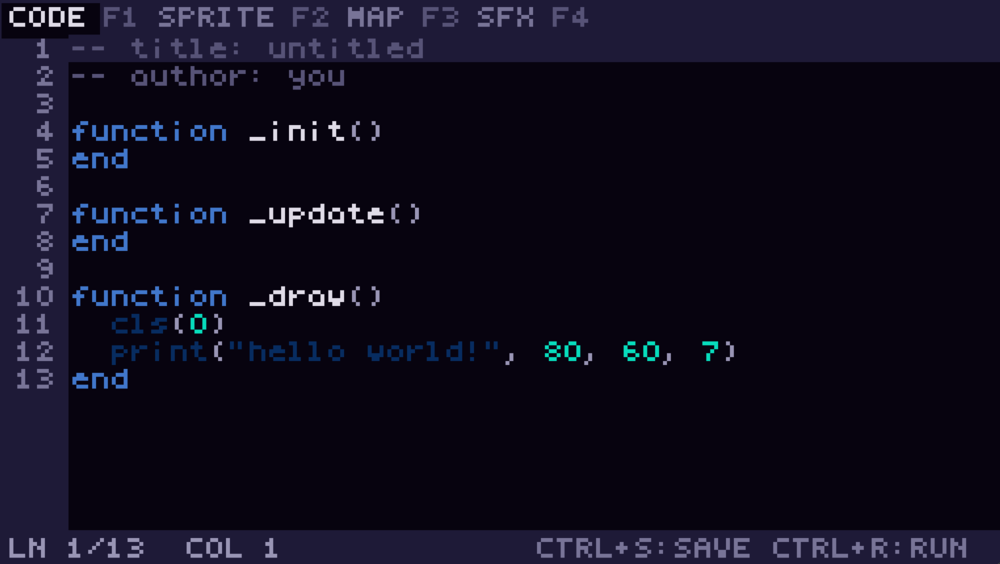
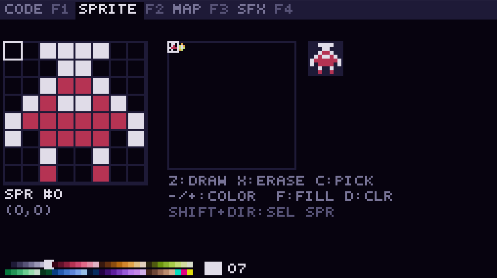
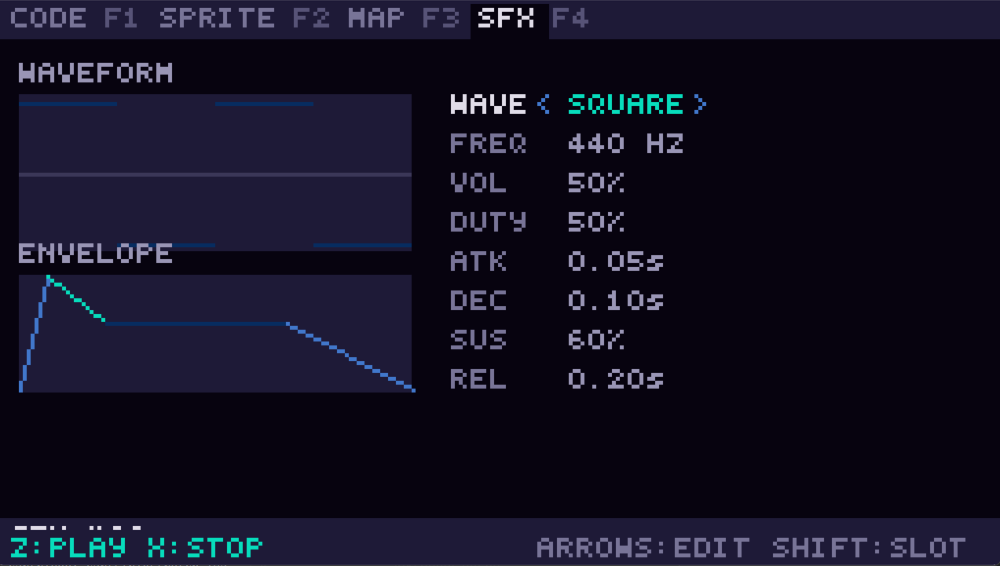

# CHROMAPLEX 8

**Fantasy Game Console · v1.0**



---

## What Is It?

Chromaplex 8 is a **fantasy game console** — a virtual machine with carefully chosen constraints designed to make creating retro-style games fast and fun. Think PICO-8, but with a wider screen, more colours, and hardware mod slots.

Unlike PICO-8's strict 128×128 / 16-colour / 32KB limits, Chromaplex 8 gives you breathing room while keeping the cozy, creative constraints that make fantasy consoles special.



## Hardware Specifications

| Component | Spec |
|-----------|------|
| **CPU** | CX8-A (virtual, 60 Hz tick) |
| **GPU** | PRISM-64: 256×144 widescreen, 64-colour customisable palette |
| **APU** | WAVE-4: 4 channels, 6 waveforms, ADSR envelopes |
| **RAM** | 128 KB base (expandable to 256 KB) |
| **Cartridge** | 64 KB max, **no token limit** |
| **Sprites** | 256 × 8×8 sprite slots with hardware scaling & rotation |
| **Tile Map** | 256×256 tiles |
| **Input** | 8 buttons: D-Pad + A/B/X/Y (keyboard + gamepads, 4 players) |
| **Font** | Built-in 4×6 pixel font |
| **Scripting** | Lua 5.4 (PickUp language support planned) |

### How It Compares

| Feature | PICO-8 | TIC-80 | **Chromaplex 8** |
|---------|--------|--------|------------------|
| Resolution | 128×128 | 240×136 | **256×144** |
| Colours | 16 | 16 | **64** |
| Cartridge | 32 KB | 64 KB | **64 KB** |
| Token limit | 8192 | None | **None** |
| Sprite scale/rotate | Manual | Manual | **Built-in** |
| Camera zoom | No | No | **Built-in** |
| Hardware mods | No | No | **Yes!** |

---

## Expansion Modules

The Chromaplex 8 module bay accepts up to 8 virtual expansion modules — each with their own manufacturer, personality, and aesthetic. Plug them in from the command line:



```
chromaplex8 --mod 0 --mod 1 carts/hello.lua
```

| ID | Module | Manufacturer | Effect | Aesthetic |
|----|--------|-------------|--------|-----------|
| 0 | **TURBO-RAM 8X** | NovaByte Industries | +128 KB RAM | Industrial grey, stamped metal |
| 1 | **SYNTHWAVE-16** | AudioLux Labs | +12 sound channels (16 total) | Chrome & purple, 80s CRT glow |
| 2 | **PIXEL-STRETCH PRO** | VisualFX Co. | Palette cycling, dithering, FX | Holographic rainbow shell |
| 3 | **CART-DOUBLER** | MegaMedia | +64 KB cartridge storage | Chunky red adapter |
| 4 | **NETLINK-1** | CyberConnect | Multiplayer networking | Antenna + blinking LEDs |

Modules can be queried and loaded from Lua:

```lua
mod_load(MOD_TURBO_RAM)
if mod_check(MOD_SYNTHWAVE16) then
    sfx(12, 440, 0.5, WAVE_SINE)  -- use channel 12!
end
```

---

## Building

### Prerequisites

- **CMake** ≥ 3.16
- **SDL2** development libraries
- **Lua 5.4** development libraries
- A C11 compiler (GCC, Clang, MSVC)

### Windows (MSVC / vcpkg)

```powershell
# Install dependencies
vcpkg install sdl2 lua

# Configure and build
cmake -B build -S . -DCMAKE_TOOLCHAIN_FILE="[vcpkg root]/scripts/buildsystems/vcpkg.cmake"
cmake --build build --config Release
```

### Linux / macOS

```bash
# Debian/Ubuntu
sudo apt install libsdl2-dev liblua5.4-dev

# macOS (Homebrew)
brew install sdl2 lua

# Build
cmake -B build -S .
cmake --build build
```

### Running

```bash
./build/chromaplex8 carts/hello.lua
./build/chromaplex8 --scale 3 --mod 0 --mod 1 carts/hello.lua
```

---

## Controls

| Key | Button |
|-----|--------|
| Arrow Keys | D-Pad (Left/Right/Up/Down) |
| Z / C | Button A |
| X / V | Button B |
| A / S | Button X |
| D / F | Button Y |
| Escape | Quit |
| Enter / Space | Skip boot screen |

---

## API Reference

### Drawing



```lua
cls([col])                              -- clear screen
pset(x, y, col)                         -- set pixel
col = pget(x, y)                        -- get pixel
line(x0, y0, x1, y1, col)              -- draw line
rect(x0, y0, x1, y1, col)             -- rectangle outline
rectfill(x0, y0, x1, y1, col)         -- filled rectangle
circ(cx, cy, r, col)                   -- circle outline
circfill(cx, cy, r, col)              -- filled circle
tri(x0,y0, x1,y1, x2,y2, col)         -- triangle outline
trifill(x0,y0, x1,y1, x2,y2, col)     -- filled triangle
print(str, [x, y, col])               -- draw text
```

### Sprites (Hardware Scaling & Rotation!)



```lua
spr(n, x, y, [w, h, flip_x, flip_y, scale, angle])
--  n       sprite index (0-255)
--  w, h    size in sprite units (default 1×1 = 8×8 px)
--  scale   1.0 = normal, 2.0 = double, etc.
--  angle   rotation in degrees

sset(x, y, col)           -- set pixel in sprite sheet
col = sget(x, y)          -- get pixel from sprite sheet
```

### Map

```lua
map(cel_x, cel_y, sx, sy, cel_w, cel_h)   -- draw map section
mset(x, y, tile)                            -- set map tile
tile = mget(x, y)                           -- get map tile
```

### Camera (with Zoom!)

```lua
camera([x, y, zoom])
--  x, y    camera offset
--  zoom    1.0 = normal, 2.0 = 2x zoom, 0.5 = zoom out
```

### Clipping & Palette

```lua
clip([x, y, w, h])     -- set clip region (no args = reset)
pal(c0, c1)             -- remap colour c0 to c1
pal()                   -- reset all colour remaps
```

### Input

```lua
pressed = btn(BTN_A)     -- is button held?
just    = btnp(BTN_UP)   -- was button just pressed this frame?

-- Per-player input (for gamepads)
pressed = btn_player(player, BTN_A)   -- player 0-3
just    = btnp_player(player, BTN_UP)

-- Gamepad queries
n = gamepad_count()              -- number of connected controllers
ok = gamepad_connected(player)   -- is player's controller plugged in?
name = gamepad_name(player)      -- controller name string
rumble(player, lo, hi, ms)       -- haptic feedback

-- Constants: BTN_LEFT, BTN_RIGHT, BTN_UP, BTN_DOWN,
--            BTN_A, BTN_B, BTN_X, BTN_Y
```

### Networking (NETLINK-1 Module)



```lua
-- Requires: mod_load(MOD_NETLINK)

net_host(name, [port])           -- host a LAN session
net_join(name)                   -- discover & join via broadcast
net_join_ip(name, ip, [port])    -- join a specific host
net_disconnect()                 -- leave session

net_send(channel, data)          -- send string to all peers
net_send_to(player, ch, data)    -- send to a specific player
msg = net_recv()                 -- returns {from, channel, data} or nil

state = net_state()              -- NET_DISCONNECTED / HOSTING / JOINING / CONNECTED / ERROR
id = net_id()                    -- my player ID (0 = host)
n = net_peers()                  -- number of connected peers
info = net_peer(id)              -- returns {id, name, active}
```

### Visual FX (PIXEL-STRETCH PRO Module)

```lua
-- Requires: mod_load(MOD_PIXSTRETCH)

fx_cycle(start, len, speed)      -- palette cycling (auto-rotate colours)
fx_cycle_stop(slot)              -- stop a cycle slot
fx_dither(mode)                  -- ordered dithering pattern
  -- DITHER_NONE, DITHER_BAYER2, DITHER_BAYER4,
  -- DITHER_CHECKER, DITHER_HLINE, DITHER_VLINE, DITHER_DIAG

fx_fade(target, speed)           -- fade screen (0.0 = black, 1.0 = full)
val = fx_get_fade()              -- current fade value
fx_shake(intensity, duration)    -- screen shake
fx_tint(r, g, b, amount)        -- colour tint (0-255, 0.0-1.0)
fx_flash(col, duration)          -- flash screen with palette colour
fx_wave(amplitude, freq, speed)  -- scanline wave distortion
fx_reset()                       -- clear all effects
```

### Audio



```lua
sfx(channel, freq, [vol, waveform, duty])
--  channel   0-3 (or 0-15 with SYNTHWAVE-16)
--  freq      frequency in Hz
--  vol       0.0 – 1.0
--  waveform  WAVE_SQUARE, WAVE_TRIANGLE, WAVE_SAW,
--            WAVE_NOISE, WAVE_PULSE, WAVE_SINE
--  duty      pulse width (0.05 – 0.95)

envelope(channel, attack, decay, sustain, release)
quiet([channel])   -- stop channel (or all if no arg)
```

### Memory

```lua
val = peek(addr)          -- read byte
poke(addr, val)           -- write byte
val = peek16(addr)        -- read 16-bit (little-endian)
poke16(addr, val)         -- write 16-bit
memcpy(dst, src, len)     -- copy memory
memset(dst, val, len)     -- fill memory
```

### Modules

```lua
ok = mod_load(MOD_TURBO_RAM)     -- load module (returns true/false)
loaded = mod_check(id)            -- check if loaded
info = mod_info(id)               -- returns table: {name, manufacturer, description, flavor, loaded}

-- Constants: MOD_TURBO_RAM, MOD_SYNTHWAVE16, MOD_PIXSTRETCH,
--            MOD_CART_DOUBLER, MOD_NETLINK
```

### Math (PICO-8 Compatible)

```lua
n = rnd([max])            -- random float [0, max)
n = flr(x)               -- floor
n = ceil(x)              -- ceiling
n = sin(x)               -- sine (0-1 input, not radians)
n = cos(x)               -- cosine (0-1 input)
n = atan2(dx, dy)         -- angle (0-1 output)
n = sgn(x)               -- sign (-1, 0, or 1)
n = mid(a, b, c)          -- middle value
t = time()               -- seconds since boot

-- Also available: SCREEN_W (256), SCREEN_H (144)
```

### Cartridge Callbacks

```lua
function _init()      -- called once at startup
function _update()    -- called every frame (60 FPS)
function _draw()      -- called every frame for rendering
```

---

## Built-in Editors

Chromaplex 8 includes a full suite of built-in editors for creating games without leaving the console.

### Code Editor



### Sprite Editor



### Sound Editor



---

## Cartridge Format

Cartridges are `.lua` files (or `.cx8` files with embedded data):

```lua
--[[cx8 cart]]
-- title:  My Game
-- author: Your Name
-- desc:   A description

-- Your game code here...

function _init() end
function _update() end
function _draw() end

__sprites__
(hex-encoded sprite sheet data)
__map__
(hex-encoded map data)
__end__
```

---

## Colour Palette

The default 64-colour palette is organised in 8 rows of 8:

| Row | Theme | Indices |
|-----|-------|---------|
| 0 | Monochrome | 0-7 (black → white) |
| 1 | Reds & warm | 8-15 |
| 2 | Oranges & earth | 16-23 |
| 3 | Yellows & lime | 24-31 |
| 4 | Greens | 32-39 |
| 5 | Blues | 40-47 |
| 6 | Purples & magenta | 48-55 |
| 7 | Skin tones, metallics, neon | 56-63 |

Colour 0 is transparent for sprites.

---

## Project Structure

```
Chromaplex 8/
├── build.bat                Build script (GCC / w64devkit)
├── README.md                This file
├── src/
│   ├── cx8.h                Hardware spec & types
│   ├── cx8_gpu.h/c          PRISM-64 graphics engine
│   ├── cx8_apu.h/c          WAVE-4 audio engine
│   ├── cx8_input.h/c        Input & gamepad subsystem (4 players)
│   ├── cx8_memory.h/c       RAM management
│   ├── cx8_cart.h/c          Cartridge loader
│   ├── cx8_modules.h/c      Expansion module system
│   ├── cx8_scripting.h/c    Lua bridge (full API)
│   ├── cx8_font.h/c         Embedded pixel font
│   ├── cx8_netlink.h/c      NETLINK-1 LAN networking (UDP)
│   ├── cx8_pixstretch.h/c   PIXEL-STRETCH PRO visual FX
│   ├── cx8_home.h/c         Home screen & menu
│   ├── cx8_editor.h/c       Editor framework
│   ├── cx8_ed_code.h/c      Code editor
│   ├── cx8_ed_sprite.h/c    Sprite editor
│   ├── cx8_ed_map.h/c       Map editor
│   ├── cx8_ed_sfx.h/c       SFX editor
│   └── main.c               Entry point, state machine & boot
├── carts/
│   ├── hello.lua            Feature demo
│   ├── bounce.lua           Bouncing ball
│   ├── modules.lua          Module bay demo
│   ├── netlink.lua          LAN multiplayer demo
│   ├── pixstretch.lua       Visual FX showcase
│   └── gamepad.lua          Controller test utility
└── docs/
    └── index.html           Full HTML documentation
```

---

## Roadmap

- [x] Built-in sprite/map/SFX editors
- [ ] PickUp language scripting support
- [x] PIXEL-STRETCH PRO palette cycling & dithering
- [x] NETLINK-1 multiplayer networking
- [ ] `.cx8` cartridge binary format with compression
- [ ] Cartridge sharing / community hub
- [x] Gamepad / controller support
- [ ] CRT shader / scanline post-processing

---

## License

Made with ❤ by the Chromaplex Team.
